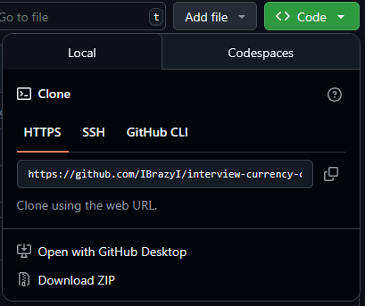
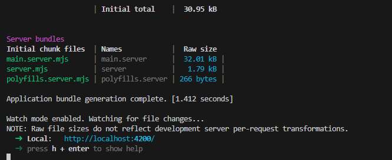

# interview-currency-converter
Welcome to my currency converter, created using Angualr using the Currency Beacon AIP [https://currencybeacon.com].
This is a simple to use currency converter with minmal styling to reduce development time.

## Requirments to run
- Code editor such as VScode.
- Node version of at least v20.19.

## Getting the project working
- First navigate to the gitHub repository.
- Click the "Code" button and see the following popup.

- Make sure HTTPS is selected and click the copy icon to copy the URL to the clipboard.

- Navigate to the code editor and open up the intergrated terminal.
- Navigate to where you would like the cloned respository saved.
- add "git clone" followed by the URL and press enter.

- If the clone is sucessful the terminal should look like this.

- cd in the same terminal to "interview-currency-converter" then cd again to "currency-converter"

- Then run "npm install", this will install the required packages to run the currency converter.
- Once complete run "npm start" to start the project.
- The project should run on the default port of "http://localhost:4200/" either enter that in your selected browser or "ctrl + click" the link in the terminal.

